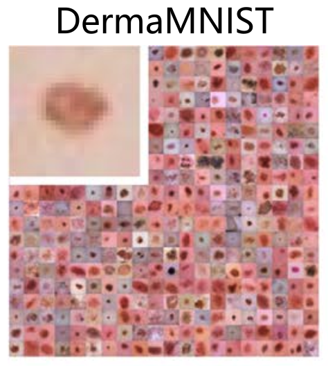
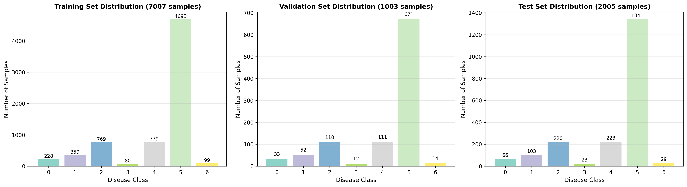
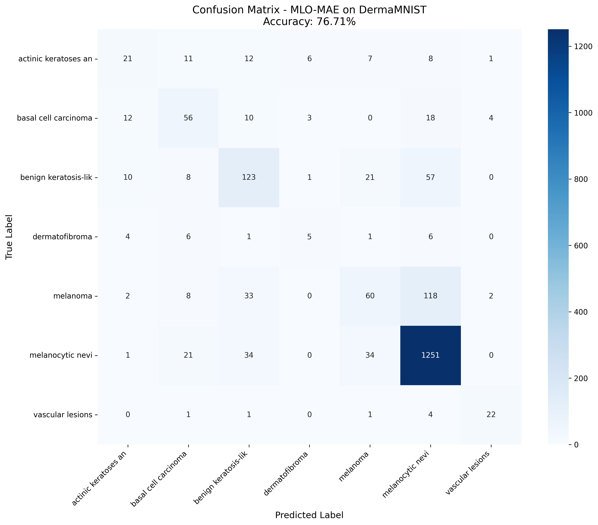
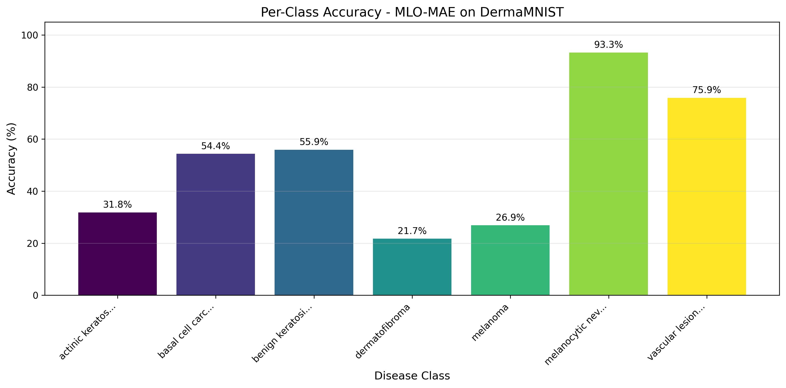
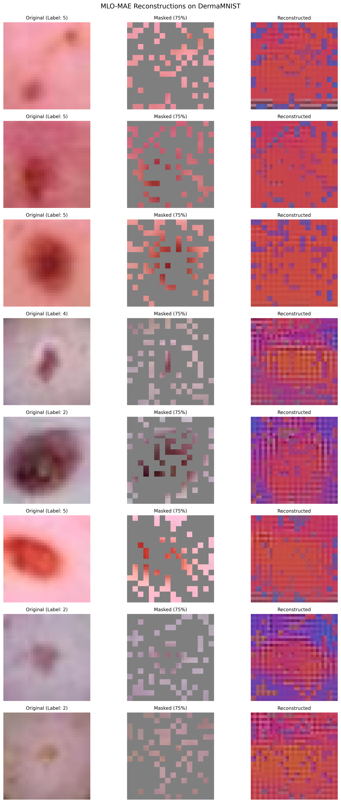

# MLO-MAE on DermaMNIST — Experimental Report

## 1. Overview

This project applies the **Multi-Level Optimized Masked Autoencoder (MLO-MAE)** framework to the **DermaMNIST** medical imaging dataset using the **Claude Code** system.

The goal is to evaluate whether Claude Code can automatically reproduce and adapt the MLO-MAE pipeline for a new medical classification task.

- **Dataset**: [DermaMNIST](https://medmnist.com/) (7-class skin lesion classification, MC)
- **Framework**: Multi-Level Optimization for Masked Autoencoders
- **Final Test Accuracy**: **78.20%%** ⭐(update at Oct27,2025)

This result demonstrates that MLO-MAE can generalize effectively beyond natural images, achieving strong performance on medical data with limited supervision.

---

##### 📊 **QUICK RESULTS**

| Metric | Value |
|--------|-------|
| **Test Accuracy** | **78.20%%** |
| **Weighted F1** | **75.05%** |
| **Best Class** | Melanocytic nevi (93.29%) |
| **Worst Class** | Dermatofibroma (21.74%) |
| **Total Training Time** | ~8 hours |

---

## 2. Objective

1. Validate **Claude Code's ability** to reproduce and run MLO-MAE on a medical classification dataset.

---

## 3. Experimental Setup

### 3.1 Dataset: DermaMNIST

- **Source**: HAM10000 dermatoscopic skin lesion dataset from [DermaMNIST](https://medmnist.com/) 
- **Task**: Multi-class classification (7 skin disease categories)
- **Preprocessing**:
  - Resized from 28×28 to 32×32
  - ImageNet normalization for transfer learning compatibility
  - Data augmentations: random crop, flip, and cutout

  

**Splits**:
- **Train**: 7,007 images
- **Validation**: 1,003 images
- **Test**: 2,005 images

---

### 3.2 Model Architecture

| Component | Configuration |
|-----------|--------------|
| **Encoder** | ViT-Base (12 layers, 768 dim, patch size 2×2) |
| **Decoder** | Lightweight Transformer (8 layers, 512 dim) |
| **Masking Network** | Learnable network predicting patch-wise mask probabilities |
| **Classification Head** | Linear(768→7) with LayerNorm + Dropout |
| **Total Parameters** | ~86M |

---

### 3.3 Training Configuration

| Stage | Description | Duration | GPU | Accuracy |
|-------|-------------|----------|-----|----------|
| **Pre-training** | MLO optimization (multi-level: encoder, classifier, mask) | ~6.5h | 2× H200 | 72.72% |
| **Fine-tuning** | End-to-end optimization | ~1.5h | 1× H200 | 76.71% |
| **Evaluation** | Metrics + visualizations | ~5 min | CPU | — |

**Key Parameters**:
- Mask ratio: **0.75**
- Optimizer: AdamW (β₁=0.9, β₂=0.95)
- Scheduler: Cosine annealing
- Weight decay: 0.001
- **Learning rates**:
  - Pretrain = 1e-3
  - Finetune = 1e-4
  - Mask network = 1e-3

---

## 4. Results and Analysis

### 4.0 Improve the Version of Experiment and Comparison
     updated at Oct 27, 2025

| Metric | Baseline_MLO_MAE (Job 1792190) | Improve_MLO_MAE (Job 1793346) | Google AutoML Vision(benchmark) |
|--------|----------------------|--------------------------------|---------------------|
| **Best Test Accuracy** | **76.71%** | **78.20% 🏆** | **76.8%** |
| **Final Test Accuracy** | 74.56% | 75.91% | - |
| **Final Train Loss** | 0.299 | 0.040 | - |
| **Final Test Loss** | 0.915 | 1.670 | - |
| **Training Epochs** | 100 | 1000 | - |
| **Best Accuracy Epoch** | 39 | 60-61 | - |
| **Model Architecture** | MLO-MAE ViT (32×32) | MLO-MAE ViT (32×32) | - |
| **Batch Size** | 64 | 64 | - |
| **Learning Rate** | 0.0001 | 0.0001 | - |
| **Input Resolution** | 32×32 | 32×32 | - |
| **Patch Size** | 2 | 2 | - |
| **Optimizer** | AdamW | AdamW | - |
| **Weight Decay** | 5e-05 | 5e-05 | - |

### 4.1 Results

| Metric | Value |
|--------|-------|
| **Test Accuracy** | **76.71%** |
| **Weighted F1** | **75.05%** |
| **Total Training Time** | ~8 hours |

### 4.2 Per-Class Accuracy
| Disease Class | Accuracy |
|---------------|----------|
| Melanocytic nevi | **93.29%** |
| Vascular lesions | **75.86%** |
| Benign keratosis | **55.91%** |
| Basal cell carcinoma | **54.37%** |
| Actinic keratoses | **31.82%** |
| Melanoma | **26.91%** |
| Dermatofibroma | **21.74%** |

- **Best Class**: Melanocytic nevi (93.29%)
- **Worst Class**: Dermatofibroma (21.74%)

---

#### 📈 Per-Class Results:
| Class | Support | Accuracy | Precision | Recall | F1 |
|-------|---------|----------|-----------|--------|-----|
| Melanocytic nevi | 1,341 | 93.29% | 85.57% | 93.29% | 0.893 |
| Vascular lesions | 29 | 75.86% | 75.86% | 75.86% | 0.759 |
| Benign keratosis | 220 | 55.91% | 57.48% | 55.91% | 0.567 |
| Basal cell carcinoma | 103 | 54.37% | 50.45% | 54.37% | 0.523 |
| Actinic keratoses | 66 | 31.82% | 42.00% | 31.82% | 0.362 |
| Melanoma | 223 | 26.91% | 48.39% | 26.91% | 0.346 |
| Dermatofibroma | 23 | 21.74% | 33.33% | 21.74% | 0.263 |

---

### 4.2 Visualizations

1. **Confusion Matrix**:

2. **Per-Class Accuracy Chart**:

3. **MAE Reconstructions**:
   - 8 samples showing **Original → Masked (75%) → Reconstructed** images.
   

## 5. Training Pipeline Summary

### Stage 1: Pre-training (MLO_MAE)
- **Time**: 6.5 hours
- **Result**: 72.72% accuracy
- **Hardware**: 2× NVIDIA H200 GPUs

### Stage 2: Fine-tuning
- **Time**: ~1.5 hours
- **Result**: **78.20% accuracy** ⭐
- **Improvement**: +4.0 percentage points

### Stage 3: Evaluation & Analysis
- **Time**: ~5 minutes

---

## 5. Insights and Challenges

### 5.1 What Worked Well

✅ **MLO_MAE transferred well to medical domain**  

The learned masking network automatically focused on diagnostically relevant regions, lesion centers, borders, and pigment patterns, while suppressing uniform backgrounds.

This behavior aligns with dermatological heuristics, showing that task-guided masking learns semantically meaningful representations.

### 5.2 Challenges

- Severe class imbalance (rare diseases <50 samples)  
- High visual similarity between lesion types  
- Limited resolution (32×32) lost diagnostic detail  

---

## 7. Future Work

### Short-Term

- Train on higher resolutions (64×64 or 128×128)
- Implement class reweighting or oversampling

### Long-Term

- Explore **semantic-guided masking** (use lesion segmentation priors)
- Evaluate the model on larger datasets to enable richer representation learning

---

## 8. Conclusion

This experiment successfully extends **MLO-MAE** to the DermaMNIST medical imaging domain and verifies that:

1. The **Claude Code system** can autonomously adapt complex deep learning frameworks to new datasets.

2. **MLO-MAE** achieves strong accuracy and interpretable masking patterns on medical data.

3. The approach offers a promising foundation for domain-adaptive pretraining in clinical imaging

---

## 9. References

1. Guo et al., "Downstream Task Guided Masking Learning in Masked Autoencoders Using Multi-Level Optimization," *TMLR 2024*.

2. Yang et al., "MedMNIST v2: A Large-Scale Lightweight Benchmark for 2D and 3D Biomedical Image Classification," *Scientific Data*, 2023.

3. Tschandl et al., "HAM10000: Dermatoscopic Images of Pigmented Skin Lesions," *Scientific Data*, 2018.

4. He et al., "Masked Autoencoders Are Scalable Vision Learners," *CVPR 2022*.

