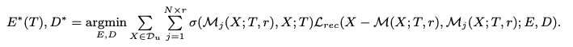
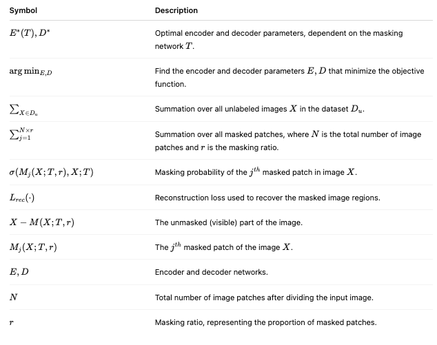
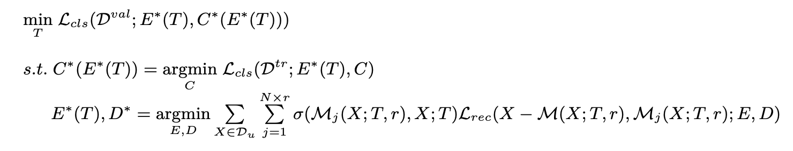
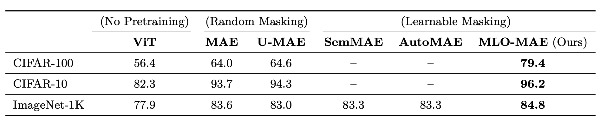
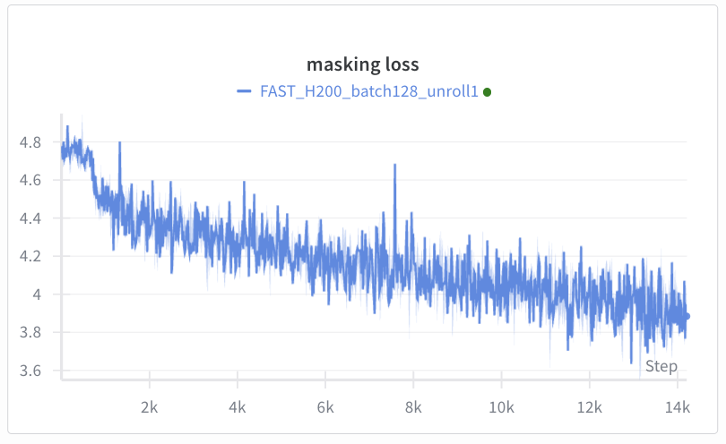

# Analysis and Extension Proposal for MLO-MAE
    Follow-up on MLO-MAE Paper & Proposed Research Directions

# 1. Executive Summary
This report summarizes my analysis of the paper of "[Downstream Task Guided Masking Learning in Masked Autoencoders Using Multi-Level Optimization](https://openreview.net/forum?id=cFmmaxkD5A)" and outlines a proposed research direction. I have successfully set up the MLO-MAE framework, and a reproduction experiment on CIFAR-100 is currently in progress. Building on its core innovation: a learnable masking network optimized with downstream task feedback. I propose enhancing the framework by integrating semantic guidance to create more intelligent, data-efficient masking strategies.

# 2. Core Understanding of MLO-MAE
The MLO-MAE paper introduces a significant advancement over standard Masked Autoencoders by replacing a fixed masking strategy with a learnable masking network. This network is trained through a Multi-Level Optimization (MLO) framework, which uses the validation loss from a downstream task (e.g., classification) as direct feedback to iteratively refine the masking policy.

Key Innovation: The model shifts from learning representations from reconstructed pixels to learning a masking strategy that reveals the most informative patches for the end task. The nested optimization ensures the encoder, classifier, and mask network are co-adapted for superior performance.

The mathematical framework and training stages (as detailed in my initial notes) formalize this three-level optimization process.

# 3. Experimental Reproduction Status
Implementation: The codebase has been established based on the official MLO-MAE repository: [MLO-MAE](https://github.com/Alexiland/MLO-MAE).

Current Experiment: Pre-training on the CIFAR-100 dataset is underway, using the paper's key parameters (Mask Ratio: 0.75).

Status: The experiment is scheduled for completion in approximately 14 hours. The next step is to fine-tune the pre-trained encoder and evaluate its Top-1 accuracy to verify the reproduction.

Environment: The implementation uses PyTorch, and the code is structured to allow for easy integration of proposed modifications.

# 4. Proposed Extension: Semantic-Guided MLO-MAE
While MLO-MAE dynamically learns masking from task-level feedback, incorporating structural or semantic priors can guide this learning process to be more efficient and effective, especially in data-scarce or semantically rich domains (e.g., medical imaging). I propose three concrete directions to explore:

    1. Soft Guidance: Biased Sampling with Semantic Heatmaps

**Idea:** A lightweight, pre-trained saliency or segmentation model generates a "semantic importance" heatmap for each image. This heatmap biases the masking network's initial sampling, lowering the probability of masking high-importance patches.

**Advantage:** Provides a soft, integrative prior that does not disrupt the MLO framework, allowing the model to occasionally mask important areas for robustness.

    2. Hard Guidance: Region-Wise Mask Ratio Control

**Idea:** Explicitly segment the image into foreground (object) and background regions. The MLO framework is then modified to learn and apply two distinct base masking ratios (e.g., a lower ratio for foreground), which are themselves optimized.

**Advantage:** Injects strong domain knowledge, which could drastically improve convergence speed and performance on tasks where object integrity is critical.

    3. Structured Guidance: Semantic-Aware Constraints

**Idea:** Introduce a regularization term or a constraint directly into the mask network's optimization loop. For example, the loss function could penalize the masking of a excessive number of patches identified as belonging to a critical object class.

**Advantage:** Most directly incorporates semantic rules, ensuring the model's behavior aligns with expert knowledge.

# 5. Proposed Next Steps
**Validation:** Complete the ongoing CIFAR-100 reproduction to establish a performance baseline.

**Initial Implementation**: Begin with Idea 1 (Soft Guidance) as the most straightforward extension, implementing the semantic heatmap bias module.

**Evaluation:** Systematically compare the performance, data efficiency, and convergence speed of the semantically-guided model against the baseline MLO-MAE on CIFAR-100 and ImageNet-1K.

**Exploration:** Based on the results, explore the more structured approaches (Ideas 2 & 3), potentially in the context of a biomedical imaging dataset to demonstrate tangible impact.

# 6. Paper Reading Notes
The following section provides detailed technical information about the MLO-MAE methodology and training detail:

## 6.1 Problem

Most masked autoencoder (MAE) approaches do not consider the specific requirements of downstream tasks. Although several variants have been proposed recently, such as U-MAE, SemMAE, and AutoMAE, they still produce suboptimal representations that are not well aligned with the objectives of these tasks.

## 6.2 Idea

Use a learnable masking network that can iteratively update the mask based on feedback from downstream performance.

## 6.3 Method

1. The mask network generates a mask that decides which parts of the input are hidden.
2. The pre-trained encoder then processes the masked input to extract useful representations, along with their corresponding labels.
3. The encoder output is used to train a classification head for downstream prediction.
4. The encoder is also evaluated on a validation set. The validation loss, calculated by comparing the predicted labels with the ground truth, is used to measure how well the mask network performs.
5. By minimizing the validation loss, the model iteratively refines the mask network, making the learned mask more effective over time.

    ####  MLO (Multi-Level Optimization)
    ##### Parameters from lower levels are used as inputs for upper levels, and non-optimal parameters from upper levels are also utilized to update the lower levels.

###  Stage 1: Pretrain Encoder

    1. The masking network computes the probability p for each patch.
    2. The top N patches are selected as the mask.

**Mathematical Formulation:**

**Symbol Definitions:**

### Stage 2: Train Classification Head

    1. Determine the class label.

**Mathematical Formulation:**

### Stage 3: Update Masking Network

    1. Assess the stage 2's results on the validation set by comparing the predicted class labels with the ground truth.
    2. Minimize the validation loss to update the masking network.

**Mathematical Formulation:**

This equation shows that the masking network T is updated by minimizing the classification loss (L_cls) on the validation dataset (D^val). The loss is calculated using the optimal encoder E* (which depends on T) and the optimal classification head C* (which depends on E*(T)).

### MLO (Multi-Level Optimization)

    Process Description: Levels 1 and 2 should execute several iterations. After that, the results of E(T), C(E(T)) are fed into Stage 3.

**Nested Optimization Problem:**

This nested optimization approach ensures that:
- The outer loop optimizes the masking network T based on validation performance
- The first inner loop finds the optimal classification head C* for a given encoder E*
- The second inner loop determines the optimal encoder E* and decoder D* through reconstruction loss minimization

## 6.4 Results of MLO_MAE

Top-1 accuracy (%) on CIFAR-10, CIFAR-100, and ImageNet test sets after fine-tuning.
SemMAE and AutoMAE are excluded from CIFAR-10/100 due to missing reported results and unavailable implementation codes.

## 6.5 Code Repository

This implementation is based on the **Multi-level Optimized Mask Autoencoder (MLO-MAE)** framework, a novel approach that leverages end-to-end feedback from downstream tasks to learn an optimal masking strategy during pretraining. The original code repository is available at [MLO-MAE](https://github.com/Alexiland/MLO-MAE).

### Supported Datasets

  - **CIFAR-10**: 10-class image classification dataset
  - **CIFAR-100**: 100-class image classification dataset (primary focus of this implementation)
  - **ImageNet-1K**: Large-scale 1000-class image classification dataset

---

## 6.6 Implementation Details

#### Architecture Components

  1. **Mask Network**: Generates adaptive masks based on input characteristics
  2. **MAE Encoder**: Processes masked inputs to extract representations
  3. **Classification Head**: Performs downstream task prediction
  4. **Multi-level Optimizer**: Coordinates optimization across different levels

### Training Process

The MLO-MAE training involves three interconnected levels:

1. **Masking Level**: Learns optimal masking strategies
2. **Pretraining Level**: Trains the encoder on masked inputs
3. **Fine-tuning Level**: Adapts representations for downstream tasks

### Key Parameters

- **Mask Ratio**: 0.75 (75% of patches masked)
- **Unroll Steps**: 
  - Pretrain: 2
  - Finetune: 1
  - Mask: 1
- **Learning Rates**:
  - Base pretraining: 1e-3
  - Base fine-tuning: 5e-4
  - Base masking: 5e-5

## 6.7 Experimental Results

### CIFAR-100 Pretraining Experiment

**Status**: ⏰ Currently in progress  
**Estimated Completion**: ~14 hours remaining  
**Scheduled End Time**: October 21, 2025 at 8:00 AM 

This experiment focuses on training the MLO-MAE model on the CIFAR-100 dataset using the multi-level optimization framework. The training process involves the three-stage approach described in the methodology section.

